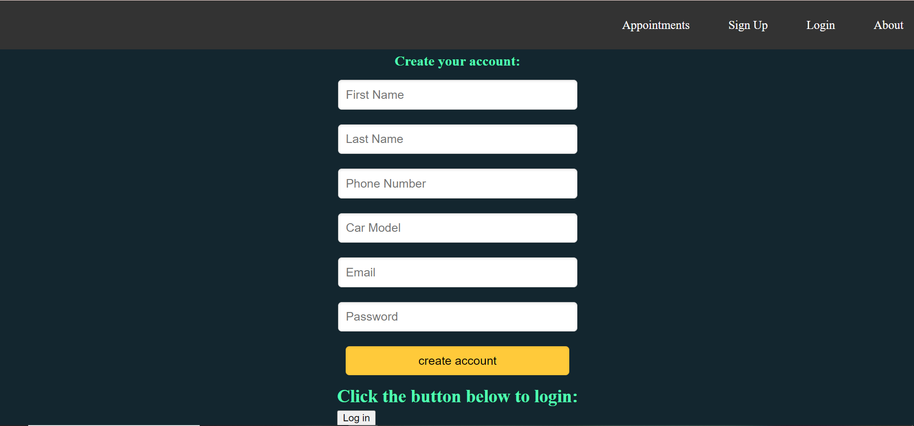
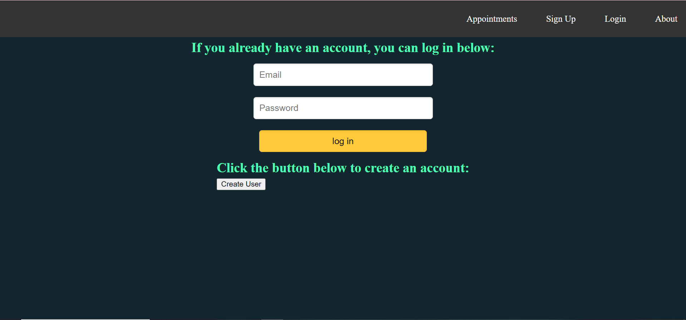
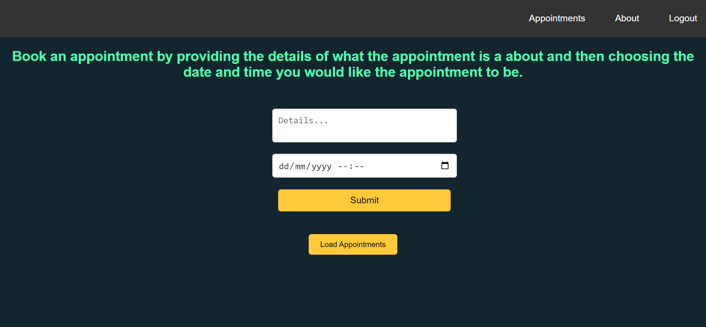

# Smartgarage

## About

### Smartgarage is a website for making garage appointments online. If you own a car, you must know the stress that comes with finding the time to get your car fixed or maintained. With this website you can simplify this process because it allows you to make an appointment on your phone or computer. Instead of going to a garage personally and having to wait for hours before you can get some service, you can just use this website to book an appointment. This way, you don't have to follow the first come first served principle that is normally used in these garages.

## Usage

### Landing page
<a href="https://smartgarage-phi.vercel.app/" target="_blank">Smartgarage landing page</a>

### Click the link below that takes you to the sign up page
<a href="https://smartgarage-phi.vercel.app/create" target="_blank">Open Smartgarage sign up page</a>

### An image of the sign up page:

### After signing up you will be redirected to a log in page that looks like this:

### Finally, after signing in, you will be redirected to a page for making appointments:

## Contributors

<a href="https://www.linkedin.com/in/brian-kyalo-17a438243" target="_blank">Brian's LinkedIn account</a>

<a href="https://www.linkedin.com/in/caroline-kalumu" target="_blank">Caroline's LinkedIn account</a>

